# A Needle in a Stack of Magic Cards

**Team Members**
- Aviv Goldstein | aviv.goldstein2@mail.huji.ac.il | aviv.goldstein
- Shaked Ben Hamo | shaked.benhamo@mail.huji.ac.il | shaked_benhamo
- Tomer Titinger | tomer.titinger@mail.huji.ac.il | tomer.titinger

**Links.** Demo video: TODO · Live app: TODO · Code: [github.com/GoldenSpringFox/DataScience-Project/tree/main/Project/EDHCut](https://github.com/GoldenSpringFox/DataScience-Project/tree/main/Project/EDHCut)

<!-- BUDGET: 6 pages of text = ~3,000 words. Figures do NOT count (a separate no-images PDF is required).
     Domain+Data ~500 | Ch1 ~700 | Ch2 ~750 | Ch3 ~650 | Future Work ~250 | Conclusion ~150
     FIGURES: 11-13 total, 3-4 per chapter. Number and caption every one, and interpret each in prose
     (the text must survive having every figure stripped out).
     CONVENTIONS from the graded examples: name every parameter with a justification; 2-4 named card
     examples per chapter; one sentence per chapter on why that chart type was chosen; state explicitly
     how we ruled out spurious findings; close each chapter with an "Algorithms: ... Tools: ..." footer. -->

---

## Domain

*Magic: The Gathering* is a trading card game with over 30,000 mechanically unique cards! The most
popular way to play is the **Commander** format, which imposes three rules on deckbuilding: exactly
**100 different cards**; one **commander** that sits outside the other 99; and every card's colors
must be a subset of that commander's *color identity*. Within it, **any card ever printed** is legal
(barring ~50 banned).

The consequence of so many options is that players struggle to **cut**. There is always a shiny new
card to add, but it is never fun to take a good one out to make space. Making good cuts means knowing
which cards are only good *together* - a **synergy package** - and finding those automatically is the
problem this project tackles.

## Data

We assembled four sources into one SQLite database (185 MB; ~560 MB with derived matrices).

| source | what it gives | size |
|---|---|---|
| **Scryfall** | every printed card: cost, type, oracle text, color identity, ~100 fields | 31,830 cards, 20 MB |
| **Scryfall Tagger** | crowdsourced mechanic labels (themes, tribes, actions) - our only ground-truth-ish account of what a card *does* | 376,800 tags over ~950 types, 55 MB |
| **Archidekt** | user-submitted decklists | 13,207 decks over 1,001 commanders, 110 MB |
| **EDHREC** | aggregate metagame statistics and commander themes | 0.5 MB |

Tagger labels are deliberately **held out of every clustering step**, which lets us use them later as
an independent check rather than an input.

Scraping every decklist would take months, so we sampled: the top 1,000 commanders at ~10 decks each,
plus ~1,000 decks on 5 specific commanders, correcting the imbalance with inverse-probability deck
weighting. Two biases are unfixable: most players never upload at all, and an uploaded deck is not
necessarily one anyone has played.

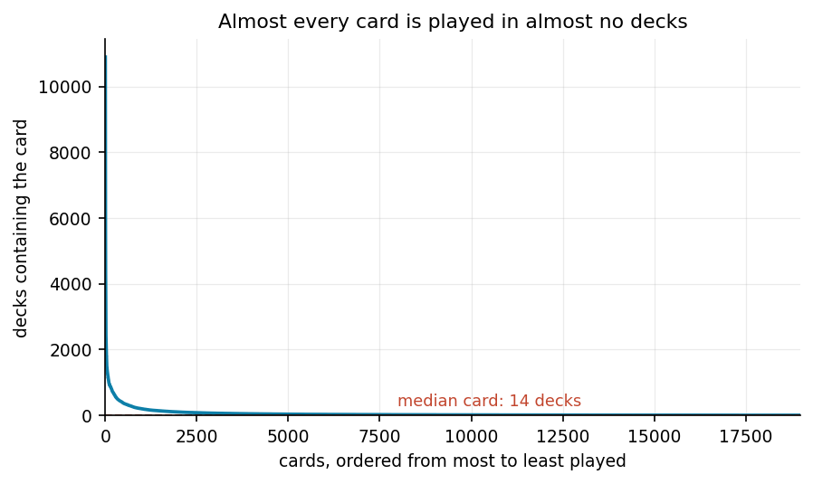
*Figure 1 - Every card in the analysis pool, ordered by how many decks play it.*

Card popularity falls off sharply - the median card appears in only 14 decks - so we require at least
3 (18,979 of 31,830 survive), and 16,026 reach the final graph. We also **exclude the commanders
themselves**, or every graph would organise itself around the 1,000 commanders rather than the themes
inside the decks.

---

## 1. Two-card combo - measuring synergy between cards

#### Problem Description

Which pairs of cards actually belong together? Sharing a deck is weak evidence of synergy: the
color-identity rule alone guarantees two white cards meet far more often than a white and a blue one,
a precon ships 100 cards together, and *Sol Ring* sits in 82.5% of decks and so correlates with
everything. We needed a number that sees through all these problems.

#### Our Solution

We turned the 13,207 decklists into a graph of cards: each card a node, each surviving pair an edge,
and the edge weight our estimate of how strongly the two want to share a deck. Everything in Question
2 is built on this graph, so a lot of effort went here.

We scored every pair with three association metrics, each fixing a flaw in the one before:

1. **Co-occurrence** - how many decks contain both cards. Simple, and dominated by popularity.
2. **Lift** - `(joint·N)/(count_A·count_B)`: how many times more often two cards meet than they would
   at random. It reads directly - "4× more than chance" - but treats two decks and two hundred as
   equally convincing.
3. **t-score** - `(observed − expected)/√observed`, which asks not how far above chance a pair sits
   but how *well-evidenced* that gap is, so a handful of decks cannot produce a headline number.

We also changed what `expected` means. The naive version divides by all ~13,000 decks, quietly
assuming any card could have gone into any deck; we divide by the decks *legally able* to run each
card. On 20 hand-picked pairs this collapses generic same-color pairs by **72-92%** while real synergy
loses a few percent, and leaves colorless pairs untouched - the algebraic check we expected.

**Our synergy score is `t-score × log(1 + lift)`.** The t-score carries the evidence, the lift carries
the effect size, and neither alone was good enough.

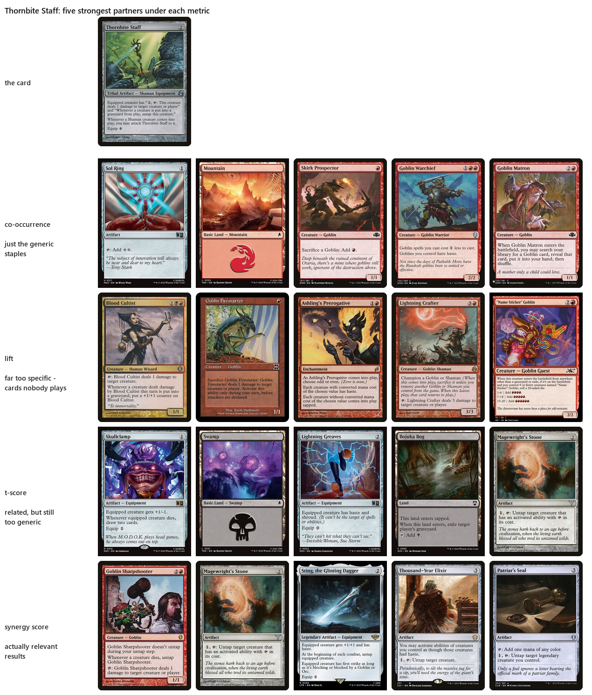
*Figure 2 - Thornbite Staff untaps a creature every time a creature dies, so what it wants is creatures with abilities worth using twice, or other untappers. Co-occurrence answers Sol Ring and Mountain; lift answers cards played in a handful of decks; t-score answers generic equipment and two lands. Only the synergy score finds the mechanic - every card it returns reads "untap target creature".*

A score only ranks pairs, though; it never says which pairings are relationships at all. That decision
turned out to be impossible pairwise, so we make it **structurally**: an edge survives only if the two
cards keep the same company, measured as the Jaccard overlap of their neighbour sets. The score says
*how strong*; the gate says *whether it is real*.

#### Evaluation

**Evaluation Criteria**

We evaluated against a hand-labelled keep/drop set of real pairs, using our own domain knowledge: a
metric works if it keeps pairs a player would call synergy and drops pairs that merely share a color
or a shelf. Generic staples should score low with everything, a card that wants thing A should score
high with suppliers of A but not B, and a card almost nobody plays shouldn't score high with anything.

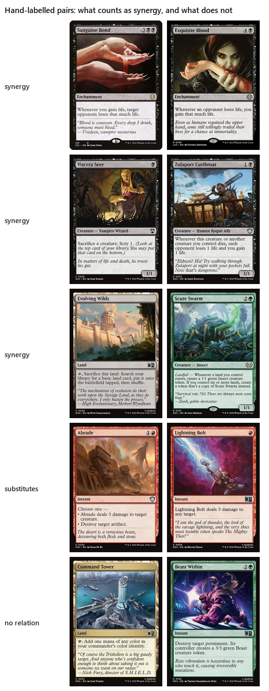
*Figure 3 - What we labelled and why. The first three pairs need each other to function; Abrade and Lightning Bolt do the same job, so they are substitutes rather than partners; Command Tower and Beast Within share decks only because both are widely played.*

[Friends - show our test set, and ask them to rate how synergistic they are]
[Friends - show pairs our synergy score rates highly/poorly, vs baseline random pair rating generator]

**Setup**

All three metrics run over the same 13,207 decks, weighted by inverse commander probability, with
precon cards down-weighted by how often players actually cut them.

**Results & Visualization**

Each metric fails in its own direction, and the failures are what built the final formula.

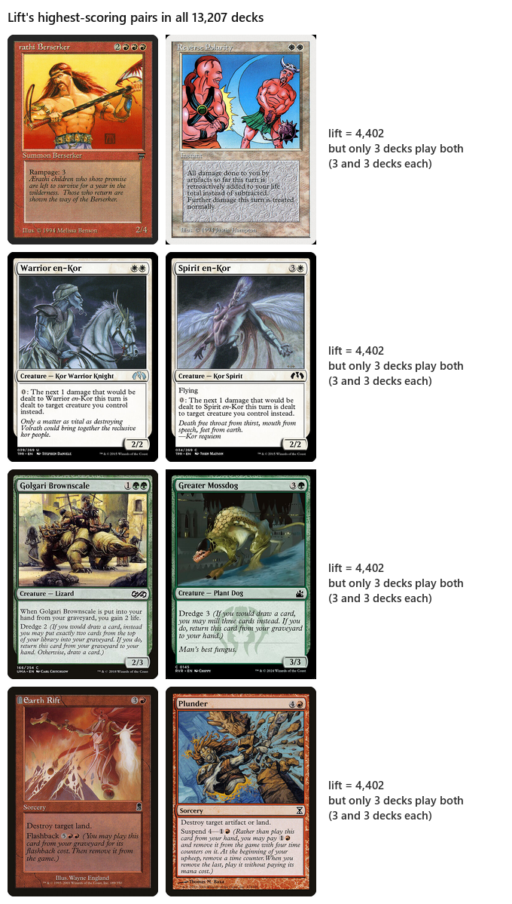
*Figure 4 - The four highest lift scores in the entire corpus.*

**Lift is disqualified outright.** Its best pairs all sit at exactly **4,402** - what two cards score
when both appear in 3 decks and never apart - while our strongest genuine combo scores 64.

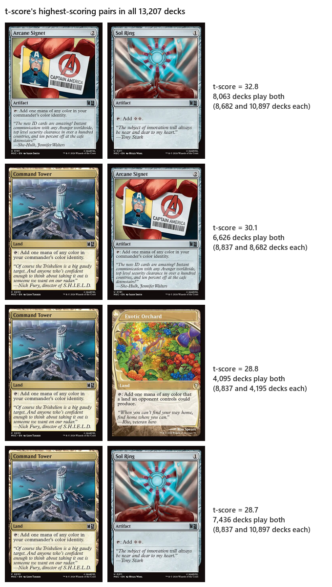
*Figure 5 - The four highest t-scores in the corpus, once basic lands are set aside.*

**t-score fails in the mirror direction.** It kills those coincidences dead, but its own top four is
*Sol Ring*, *Arcane Signet* and *Command Tower* in every combination - cards in thousands of decks that
go in everything.

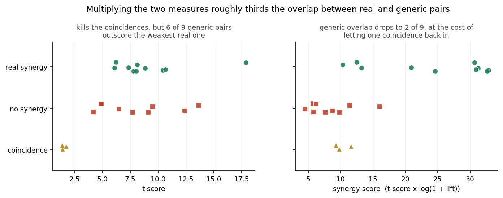
*Figure 6 - Our 22 hand-labelled pairs under t-score and under the product. A strip plot is the right display because the only question is whether the three groups occupy separate regions.*

**The product balances them.** Under t-score, 6 of the 9 generic pairs outscore the weakest real pair;
multiplying by `log(1 + lift)` cuts that to **2 of 9**.

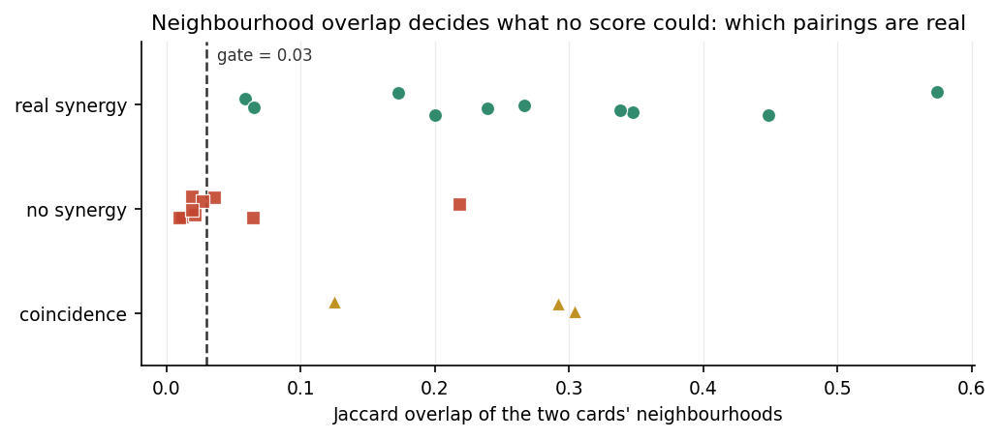
*Figure 7 - The same pairs by how much their neighbourhoods overlap, with the 0.03 gate marked.*

**The gate decides what the score cannot.** At 0.03 it keeps all 10 synergy pairs and drops 7 of the 9
others. Both survivors are removal spells - *Abrade* + *Lightning Bolt*, *Swords to Plowshares* +
*Loran of the Third Path* - which keep the same company without needing each other. That is a different
relationship entirely, and what Question 3 takes up.

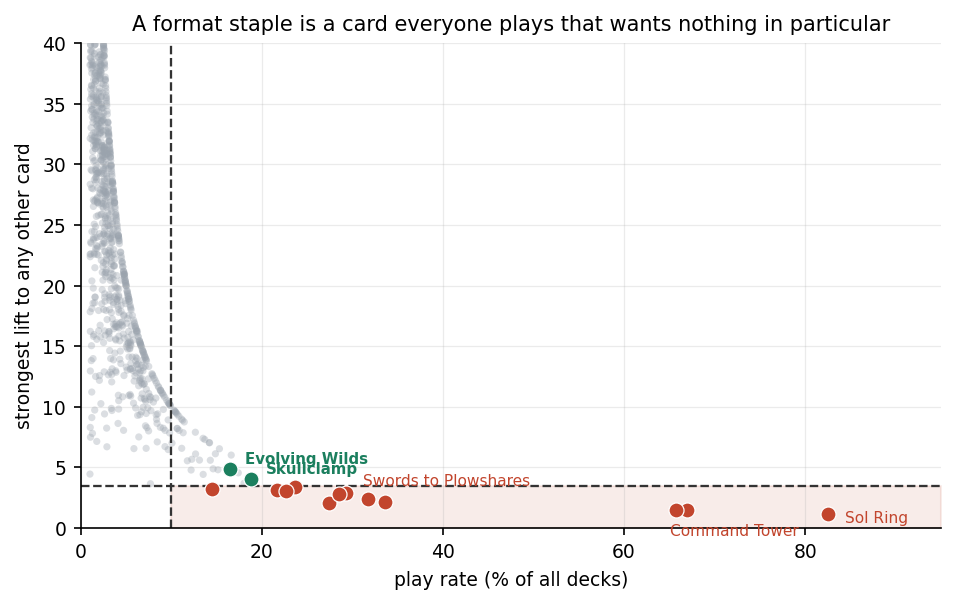
*Figure 8 - Play rate against a card's strongest lift to anything. The shaded box is the exclusion rule.*

Generic staples pass every filter, so we caught them by a different property: no above-chance affinity
to *anything*. *Sol Ring*'s strongest lift in the format is **1.13** against *Lion Sash*'s **104.6**,
and `max lift < 3.5 and play rate ≥ 10%` selects exactly 12 cards to exclude.

**Impediments**

Most of our parameters are mitigations rather than free choices:

| problem | what we did |
|---|---|
| Thin evidence - the median card is in 14 decks | require ≥3 decks; below that, a package and a coincidence look identical |
| Graph too dense to cluster | keep each card's 15 strongest edges, union-symmetrised so a niche card keeps its link to a popular one |
| Borderline edges | Jaccard gate at ≥ 0.03; reading the 0.02–0.03 band by hand found it almost entirely staple noise, 82% of it linking unrelated communities |
| Pre-constructed decks donate thousands of meaningless pairs | down-weight precon cards by how often players actually cut them |

**Tools**

Algorithms: *lift, t-score, color-conditioned null model, Jaccard neighbourhood overlap.*

Libraries: *pandas, numpy, scipy, SQLite.*

---

## 2. "This would go great in my dragon deck!" - recovering card packages from co-occurrence

#### Problem Description

A good magic deck picks a theme and adds cards from **packages** that serve it. Since you draw only
part of your deck each game, redundant synergies matter, and a package promises its cards work
together. Can those packages be recovered from co-occurrence alone, by a system that has never read a
card? And does a card belong to one package or several?

#### Our Solution

We ran community detection on the synergy score graph from Question 1 (16,026 cards, 158,294 edges),
comparing two algorithms:

1. **Louvain** gives a **hard partition**: every card lands in exactly one community, chosen to
   maximise modularity. Fast, easy to reason about, and taught in class.
2. **symNMF** gives a **soft** one. It factorises the graph as `S ≈ H·Hᵀ` with `H ≥ 0`, so each row of
   `H` is a card's membership spread across `k` topics. A card can belong to three packages with
   weights rather than being forced into the best one.

To test whether the communities match known themes, we label each with mechanic tags from **Scryfall
Tagger**, scoring every tag by `share × log(1 + lift)` and requiring it to be both common (≥10% of the
community) and distinctive (lift ≥ 8 over ≥4 cards). Either alone gives nonsense: `share` picks tags
every card carries, `lift` picks freak tags on four cards. **Those tags never enter the clustering**,
so agreement between them and the communities means something.

| parameter | value | why |
|---|---|---|
| topics `k` | 200 | chosen to be comparable to Louvain's community count on the same graph |
| membership floor | share ≥ 10%, at most 5 topics | below a tenth of a card's mass, membership is noise |
| k-core floor | k = 4 | a card must have 4 edges *inside* a community to belong to it; tested against a hand-labelled set, it removed 11 of 12 cards we had flagged as misplaced and 0 of 12 known core members |
| seed | 42, fixed | symNMF is non-deterministic - see Evaluation Criteria |

#### Evaluation

**Evaluation Criteria**

The system gets no game knowledge, so success means the packages are recognisable *afterwards*. Three
checks: the held-out tags must name each community specifically; color purity must beat same-size
random draws; and the result must survive a change of random seed, measured against a
**degree-preserving rewiring** of the graph - same cards, same connection counts, structure destroyed.

[Friends - ask them to match tags to communities, see if they agree with our algorithm]

**Setup**

symNMF converges in 24 seconds, producing 200 communities against Louvain's 244. A standing guard
checks that no oversampled commander quietly becomes a "package".

**Results & Visualization**

The communities are real and legible: Equipment, Landfall, Extra Turns, Shrines, Cascade, Deserts,
Allies and twenty-odd typal packages, all named by tags the clustering never saw.

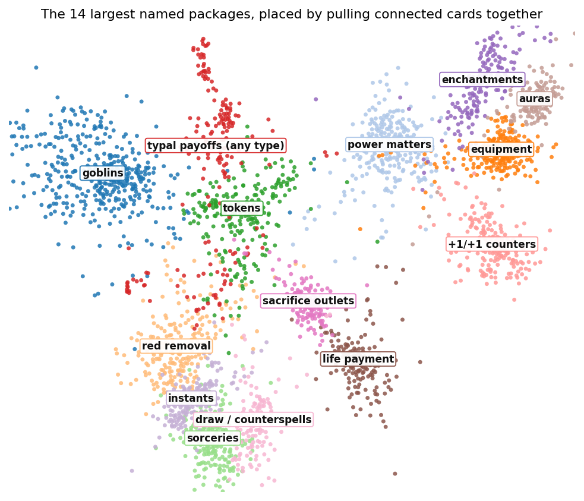
*Figure 9 - The 14 largest named packages. Cards are pulled together by edge weight, so distance on the page is synergy. A force-directed layout is the right chart here because the claim is about grouping, and grouping is the thing it makes visible.*

Our own title case is the best illustration. Dragons come out not as one package but **three**, split
by how the deck plays rather than by creature type: an aggressive Rakdos core (79 cards), a multicolor
ramp shell (62), and a Grixis control build (41). "Would this go great in my dragon deck?" has three
different answers.

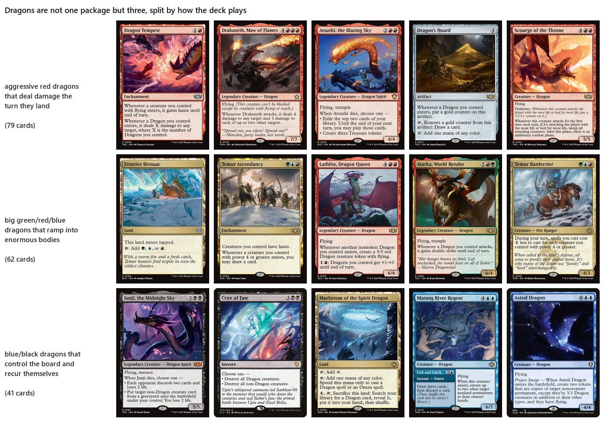
*Figure 10 - The most-played members of each dragon package.*

The soft/hard difference is the sharpest finding: cards average **1.45** memberships and **41% belong
to more than one community**, structure a hard partition cannot represent. *Mondrak, Glory Dominus*
doubles your tokens, is an expensive staple played in high-power decks, and is a Phyrexian - and the
model independently places it 47% in token payoffs, 22% among powerful staples and 21% in Phyrexian
typal. One package per thing the card does, without reading a word of it.

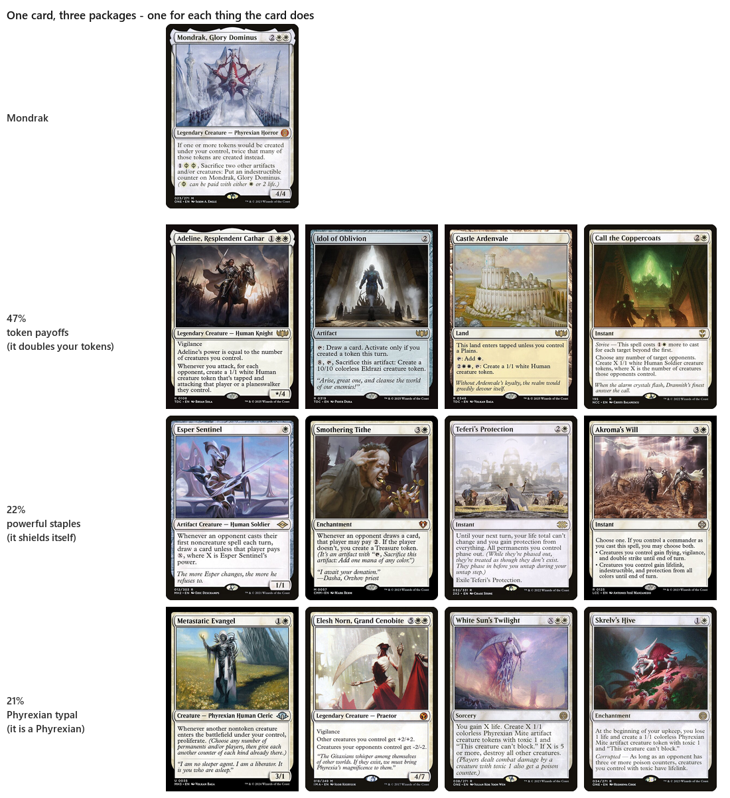
*Figure 11 - Mondrak and the three packages it belongs to, with the share of its membership in each.*

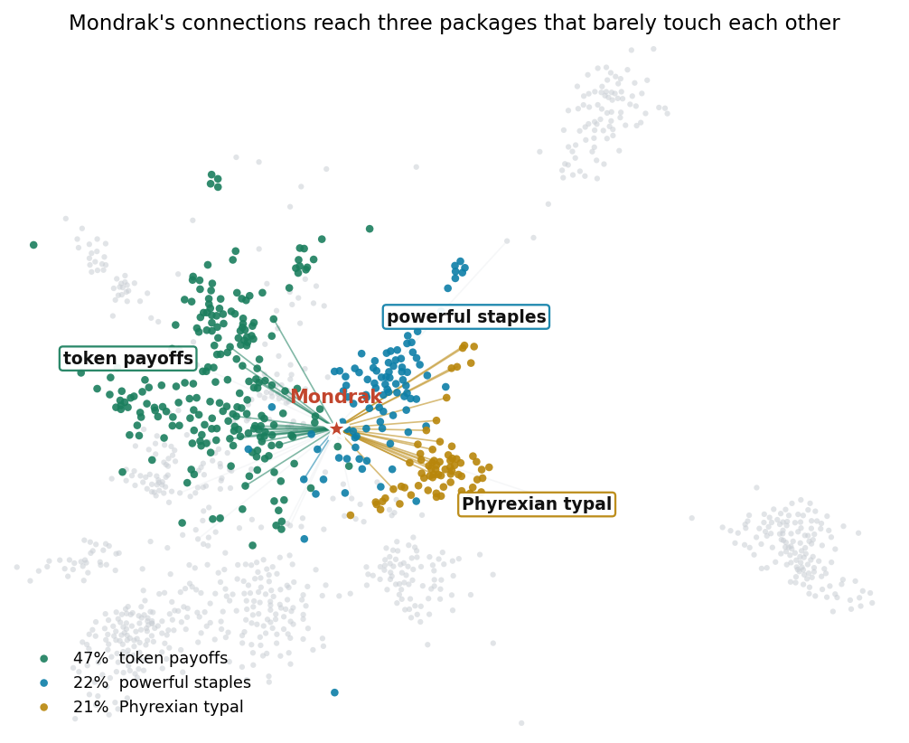
*Figure 12 - Mondrak's own connections, drawn over the graph. Everything it does not connect to is greyed out. The three packages barely touch each other, which is why no single label can describe it.*

That effect concentrates exactly where it matters most - on the popular, multi-purpose cards a player
actually agonises over cutting, and the ones a hard partition describes worst.

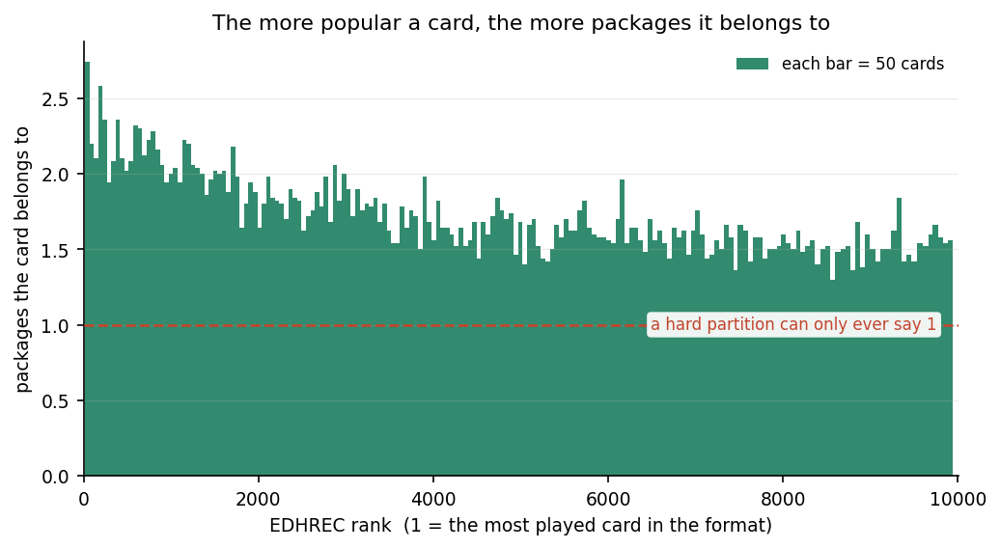
*Figure 13 - The 10,000 most-played cards, in bins of fifty by EDHREC rank, against the number of packages they belong to. The top 2,000 cards average 2.10 packages against 1.52 at rank 10,000, and past rank 10,000 the line stays flat at about 1.4.*

Neither result is chance. Color purity reaches **56.6%** across the 200 communities against a
same-size random null of **19.4%**, and refitting at five seeds reproduces **76%** of the structure
against **43%** on the rewired graph.

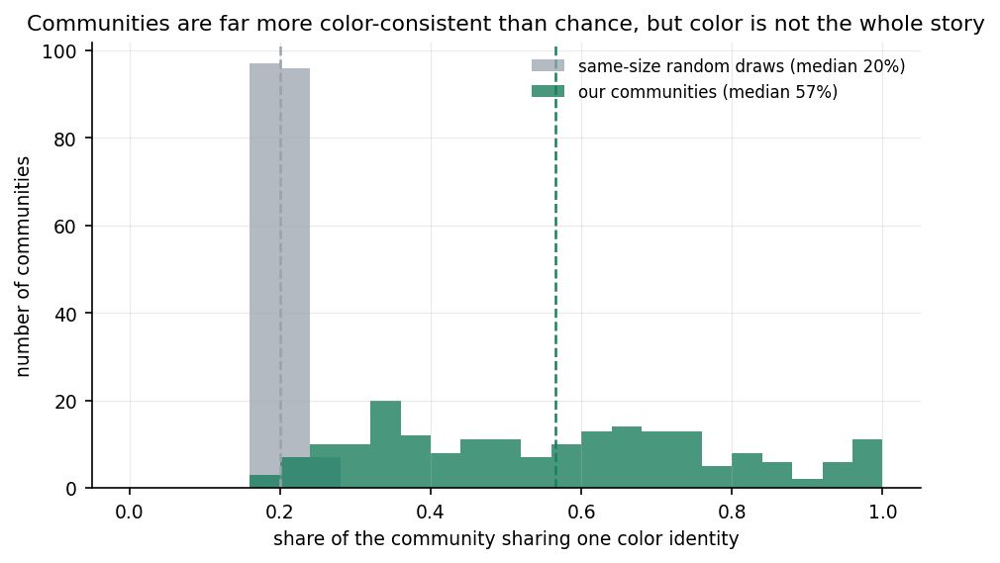
*Figure 14 - How color-consistent each community is, against same-size random draws from the same pool of cards.*

**Impediments**

Several methods failed before symNMF worked. **Girvan-Newman** cost ~65 minutes per subgraph,
**k-clique percolation** ignores edge weights and collapsed the graph into one 15,479-node blob, and an
earlier **NMF** model produced 40 topics that never read as archetypes. **Degree normalisation**
improved every metric we could measure while producing visibly worse communities, so we left it off.

One bias survives: controlling for popularity, **31% of three-color cards** land in no community at
all, against 3-6% for every other color count - they are legal only in decks covering all three
colors, so their partners spread too thin to clear the k-core floor.

**Tools**

Algorithms: *symNMF, Louvain, k-core, modularity, adjusted Rand index.*

Libraries: *networkx, scipy, numpy, ipysigma.*

---

## 3. Reading the card explains the card - text similarity vs. co-occurrence

#### Problem Description

Question 2's model never read a single card. This one reads nothing else. Both produce a list of
"cards like this one", so do the lists agree? The answer is a distinction the project needed anyway:
suggesting a **replacement** for a card is a different job from suggesting what to build **around**
it. Cutting a card raises the first question, keeping it the second.

#### Our Solution

We built a second similarity measure that never looks at a decklist: every card becomes a vector of
what is printed on it, compared by the angle between vectors. One algorithm does the work:

1. **TF-IDF + truncated SVD** - `TF-IDF` scores a word by how often it appears on *this* card against
   how many cards use it at all, so a word every card carries counts for almost nothing and a rare one
   counts for a lot. `SVD` then compresses the result to 64 numbers that keep the directions the cards
   actually differ along.

A Magic card looks busy, but holds only five things worth reading, each in the same place on every card
ever printed: a **name**, a **mana cost**, a **type line**, a box of **abilities**, and for creatures a
**power and toughness**. The rest is decoration, and our model ignores it.

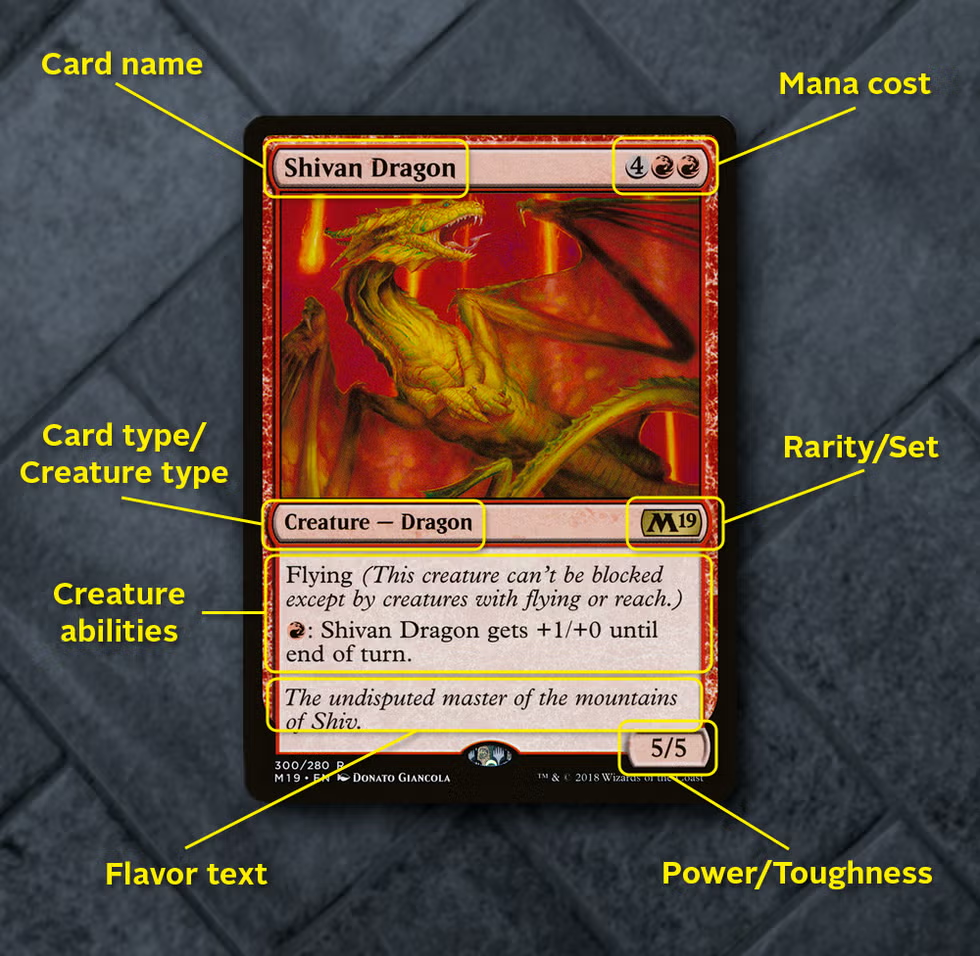
*Figure 15 - The five parts of a card our model reads, on a card that is also a member of Question 2's dragon package. The flavour text and set symbol are ignored.*

Those parts matter unequally, so each goes into its own block, is scaled to the same length, and is
then weighted. Keeping them separate matters: pooled into one bag of words, a single shared type-line
word like "Human" outweighs a terse card's actual ability.

| block | weight | why |
|---|---|---|
| rules text | 0.6 | what the card actually does, and the only block that describes behaviour |
| type line | 0.15 | creature vs artifact vs enchantment separates cards that read alike but play differently |
| mana cost | 0.15 | a one-mana and a six-mana version of the same effect are not replacements for each other |
| power / toughness | 0.1 | creatures only; redistributed onto the other blocks otherwise |

#### Evaluation

**Evaluation Criteria**

Success is that the text measure returns cards a player would accept as **replacements**, and that it
demonstrably answers a different question from co-occurrence. The first is judged by reading real
output - the only honest test with no ground truth - plus a standing check: *Cultivate*'s nearest
neighbour must be *Kodama's Reach*, the same card under two names. The second is measurable: we compare
**functional categories** against **synergy packages**, using Tagger groups that entered neither
model.

[Friends - ask them to name a replacement for a card and a partner for it, and see which of our two lists matches which question]

**Setup**

Text vectors cover all 31,623 commander-legal cards - every card, whether or not anyone has ever put
it in a deck, which is exactly what co-occurrence cannot do.

**Results & Visualization**

The text measure finds replacements, and the clearest way to see it is beside the other list.

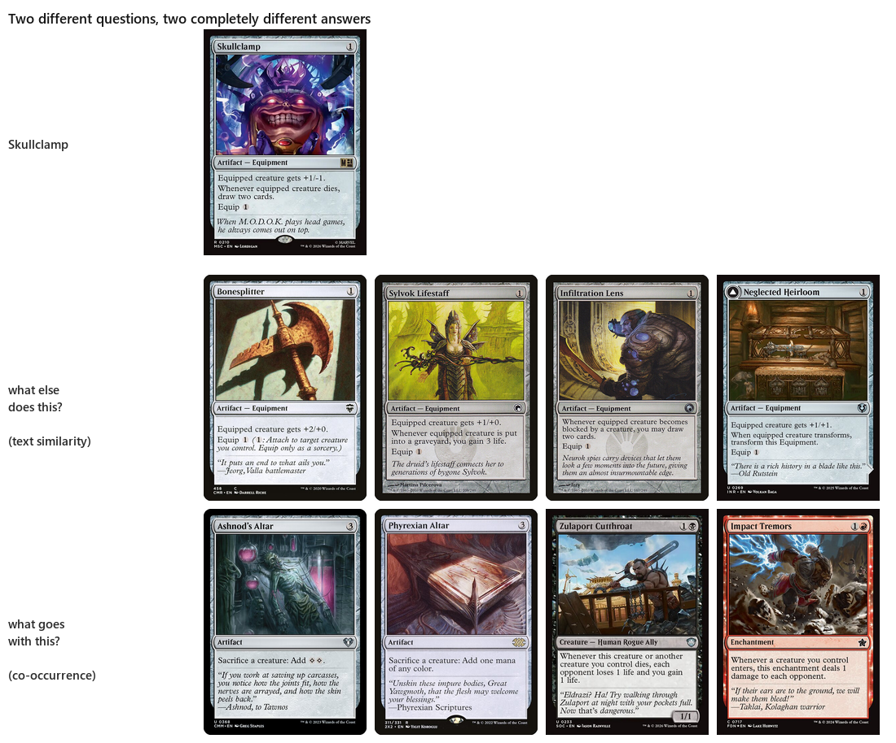
*Figure 16 - Skullclamp's four nearest cards under each signal. Text returns four other cheap Equipment - things you could play instead. Co-occurrence returns the sacrifice engine it is played with, and not one of them is an Equipment.*

Both are correct answers to different questions: "what do I put in this slot instead?" wants the
first, "is this card doing anything here?" the second.

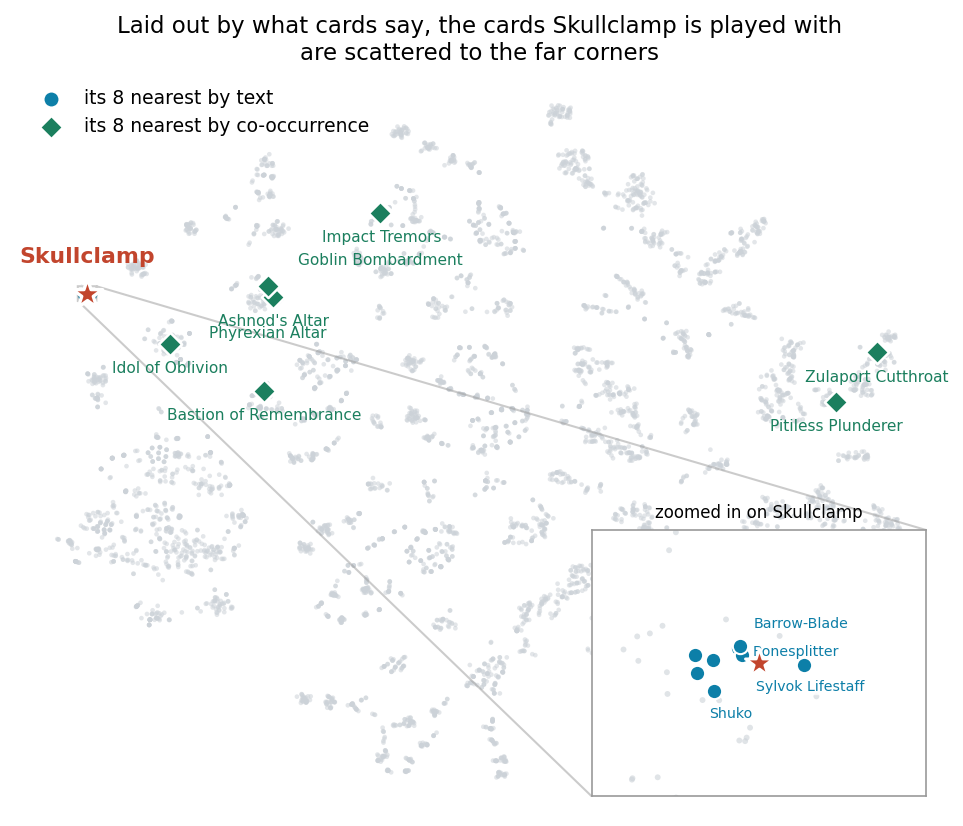
*Figure 17 - The text space projected down to two dimensions. Skullclamp's text neighbours sit at cosine similarity 0.97 and above - so close they occupy one point and need the inset to be seen - while the cards it is actually played with scatter to opposite corners.*

The two signals are close to unrelated, and that is measurable rather than impressionistic.

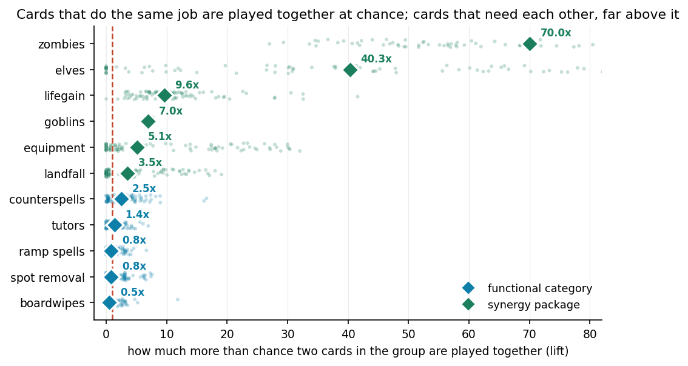
*Figure 18 - Every pair among each group's fourteen most-played cards, by how much more than chance the two are played together. Functional categories sit at a median lift of 0.99 - exactly chance - while synergy packages sit at 9.15, with no overlap between the two kinds of group.*

Text similarity cannot make that distinction at all - the groups that read most alike are goblins (a
package) and counterspells (a category). It also settles two loose ends: *Starfall Invocation* landed
in no community because every other boardwipe had already been cut from its neighbourhood, and *Abrade*
+ *Lightning Bolt* survived Question 1's gate for the same reason.

One last thing the text space told us is really a fact about the game rather than about our model.

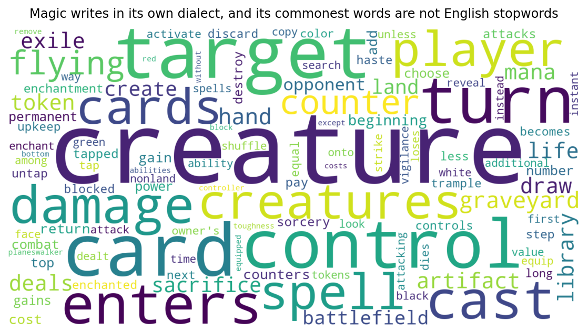
*Figure 19 - Every word in the rules text of all 31,491 commander-legal cards, sized by how often it appears. The word "creature" appears on 69.4% of all cards, "target" on 39.4%, "control" on 30.7%.*

Magic writes in its own narrow dialect, and an English stopword list - which strips "the" and "of" -
leaves all of those untouched, so a real share of what our vectors measure is vocabulary the whole game
shares rather than anything specific to the card.

**Impediments**

**A land that taps for white and a creature that taps for white read almost identically**, and early
on 14 of *Avacyn's Pilgrim*'s 15 nearest cards were lands. No statistic can discover that a land is
never a replacement for a spell - a deck runs ~37 of them regardless - so we encoded that boundary
directly. The deeper limit is that text similarity has no idea what a card is *worth*: two cards can
read identically and be separated by a decade of power creep, which is why we would not ship
replacement suggestions from text alone.

**Tools**

Algorithms: *TF-IDF, truncated SVD, cosine similarity, t-SNE.*

Libraries: *scikit-learn, numpy, pandas.*

---

## Future Work

**Sharpening what we built.** We removed each confounder separately but never measured how much of the
raw signal each accounts for, and neighbourhood overlap was simply the first structural statistic we
tried. Our 200 packages were chosen to match the hard partition's count and are probably too coarse - a
granularity sweep peaked closer to 1,200 - and neither the gate nor the membership floor knows anything
about color legality, which is why 31% of three-color cards go unassigned.

**Question 3 - reading cards.** Figure 19 is the clearest lead: our model treats rules text as English
when it plainly is not, so the next version should be built for Magic specifically, with its own
stopword list and a decomposition fitted to this dialect. We would also predict a card's package from
its rules text alone, turning Question 2's output into labels and Question 3's vectors into features.

**The tool this was all for.** The knowledge base exists to power a cut recommender: score each of a
deck's 99 cards by how weakly it attaches to that deck's packages, and suggest the loosest. Ground
truth already exists in our data - thousands of our decks began as a preconstructed product, so we can
see **which cards real players actually cut** when upgrading one, and check whether our score agrees.

## Conclusion

Co-occurrence between cards is mostly artifact - legality rules, the products people buy, and the
handful of cards that go in everything explain most of it - and no statistic computed from a pair in
isolation separates the real relationships from the rest. What worked was to stop asking about the
pair and start asking about the company each card keeps.

What survives that filtering is structural. A system given no card text, no types and no rules of the
game recovered goblins, landfall, equipment and three kinds of dragon deck, and we could name them
with labels it had never seen. Reading the cards themselves answered a different question entirely -
which card could *replace* this one - and a real cut recommender needs both. The knowledge base is
built and validated; the tool that would consume it is not, and what we have is a solid baseline for
it.

## Afterword

It was increadibly fun to work on this project. As someone who is both visually oriented and constantly thinking about this hobby, it's super cool seeing these connections i've been developing in my head take form on these graphs. It's incredible how simple and accessible exploring the data is these days, and i'm definitly intending to finish this tool and uploading it to the internet for other people to use. There is a widespread epidemic of EDHREC-ification, where deckbuilding data isn't accessible enough, so people go to edhrec and put in only genericly popular cards, instead of looking for cool niche synergy pieces.

By the way, we found the needle! better drop it back for the next group to find:

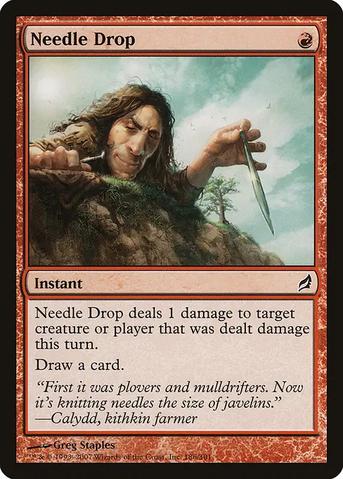
*Figure 20 - Needle Drop.*
